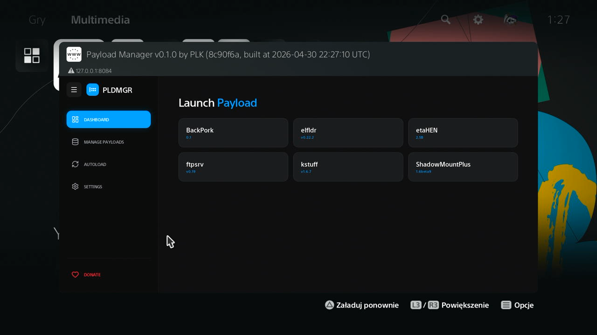

# 🎮 PS5 Payload Manager & Mini-Store

Bienvenue sur mon écosystème automatisé pour la scène jailbreak PS5 !

🌐 **Site Web Vitrine :** [Visiter le site PS5 Super PLDMGR Auto Updater](https://nexgen999.github.io/PS5-Super-PLDMGR-Auto-Updater/index.html)

## 🔗 URLs Fixes des Stores JSON
* **Payloads Store JSON :** `https://nexgen999.github.io/<repo>/json/payloads.json`
* **Packages PKG Store JSON :** `https://nexgen999.github.io/<repo>/json/pkg.json`
* **FFPFSC Store JSON :** `https://nexgen999.github.io/<repo>/json/ffpfsc/ffpfsc.json`

## 📦 Archives AIO Releases (Dernières Versions)
* 🚀 **AIO Payloads Offline (.zip) :** [Télécharger](https://github.com/nexgen999/<repo>/releases/download/latest/ps5_super_pldmgr_auto_updated_offline.aio_latest.zip)
* 📦 **AIO PKG Offline (.zip) :** [Télécharger](https://github.com/nexgen999/<repo>/releases/download/latest/PS5PKG_aio_latest.zip)
* 📄 **AIO FFPFSC Offline (.zip) :** [Télécharger](https://github.com/nexgen999/<repo>/releases/download/latest/ffpfsc_aio_latest.zip)

---

## 📦 Packages PS5 (.pkg) Disponibles

| Package | Auteur | Version | Description |
| :--- | :--- | :--- | :--- |
| **[ProsperoLight](https://github.com/blackbearreloaded/ProsperoLight/releases/download/01.000.050/PPSA99002.ffpfsc)** | blackbearreloaded | v1.0.0 | PS5 Moonlight |
| **[ProsperoRadio](https://github.com/blackbearreloaded/ProsperoRadio/releases/download/01.000.005/PPSA99001.ffpfsc)** | blackbearreloaded | v1.0.0 | PS5 Radio Player |
| **[ProsperoTV](https://github.com/blackbearreloaded/ProsperoTV/releases/download/01.000.003/PPSA99003.ffpfsc)** | blackbearreloaded | v1.0.0 | PS5 IPTV |
| **[Avatar-Changer](https://github.com/nexgen999/Evox_PS5PKG_Private/releases/download/v1.0/PS5PKG_Avatar-Changer_v1.00.pkg)** | Lapy | v1.00. | Avatar-Changer. |
| **[FPKGi](https://github.com/nexgen999/Evox_PS5PKG_Private/releases/download/v1.0/PS5PKG_FPKGi_v1.10.0.pkg)** | ItsJokerZz | v1.10.0. | FPKGi. |
| **[HOMEBREWLOADER](https://github.com/nexgen999/Evox_PS5PKG_Private/releases/download/v1.0/PS5PKG_HOMEBREWLOADER_v0.30.pkg)** | ps5-payload-dev | v0.30. | HOMEBREWLOADER. |
| **[Homebrew_Store_installer](https://github.com/nexgen999/Evox_PS5PKG_Private/releases/download/v1.0/PS5PKG_Homebrew_Store_installer.pkg)** | pkg-zone | v1.0.0 | Homebrew_Store. |
| **[InternetBrowser-Game_Menu](https://github.com/nexgen999/Evox_PS5PKG_Private/releases/download/v1.0/PS5PKG_InternetBrowser-Game_Menu_v1.00.pkg)** | ps5xploit | v1.00. | InternetBrowser-Game_Menu. |
| **[InternetBrowser-Media_Menu](https://github.com/nexgen999/Evox_PS5PKG_Private/releases/download/v1.0/PS5PKG_InternetBrowser-Media_Menu_v1.00.pkg)** | ps5xploit | v1.00. | InternetBrowser-Media_Menu. |
| **[PS5-SHOP-APPKG](https://github.com/ps5xploit/ps5shopappkg/releases/download/ps5shopappkg/PS5-SHOP-APPKG.pkg)** | ps5xploit | v1.0.0 | PS5-SHOP-APPKG need etahen or ps5shopappkg-dpi . |
| **[Itemzflow_Game_Manager](https://github.com/nexgen999/Evox_PS5PKG_Private/releases/download/v1.0/PS5PKG_Itemzflow_Game_Manager_v1.14.pkg)** | Itemzflow | v1.14. | Itemzflow_Game_Manager. |
| **[PS5-Xplorer](https://github.com/nexgen999/Evox_PS5PKG_Private/releases/download/v1.0/PS5PKG_PS5-Xplorer_v1.05.pkg)** | Lapy | v1.05. | PS5-Xplorer. |
| **[PS5Webit-Nexgen999_Installer](https://github.com/nexgen999/Evox_PS5PKG_Private/releases/download/v1.0/PS5PKG_PS5Webit-Nexgen999_Installer_v1.00.pkg)** | Master0 | v1.00. | PS5Webit-Nexgen999_Installer. |

---

## 📦 Payloads (.elf / .bin) Disponibles par Catégorie

### 🔓 PS5 Activation
📂 **JSON Catégorie :** `https://nexgen999.github.io/PS5-Super-PLDMGR-Auto-Updater/json/PS5_Activation.json`

| Application | Version | Empreinte SHA-256 | Description |
| :--- | :--- | :--- | :--- |
| **np-fake-signin** | [v1.3](https://nexgen999.github.io/PS5-Super-PLDMGR-Auto-Updater/payloads/PS5_Activation/np-fake-signin/v1.3/np-fake-signin_v1.3.elf) | `2ace1bb0be...` | Fake activate PS5 without PSN. |

### 🏴‍☠️ PS5 Cheat
📂 **JSON Catégorie :** `https://nexgen999.github.io/PS5-Super-PLDMGR-Auto-Updater/json/PS5_Cheat.json`

| Application | Version | Empreinte SHA-256 | Description |
| :--- | :--- | :--- | :--- |
| **CheatRunner** | [v0.17](https://nexgen999.github.io/PS5-Super-PLDMGR-Auto-Updater/payloads/PS5_Cheat/CheatRunner/v0.17/CheatRunner_v0.17.elf) | `2f296d3f1e...` | CheatRunner. |
| **kylin-core-community-lite-v131-global-release** | [Source-Fixe](https://nexgen999.github.io/PS5-Super-PLDMGR-Auto-Updater/payloads/PS5_Cheat/kylin-core/Source-Fixe/kylin-core-community-lite-v131-global-release.elf) | `2b731fc60b...` | kylin-core |

### 📦 PS5 Overlay
📂 **JSON Catégorie :** `https://nexgen999.github.io/PS5-Super-PLDMGR-Auto-Updater/json/PS5_Overlay.json`

| Application | Version | Empreinte SHA-256 | Description |
| :--- | :--- | :--- | :--- |
| **Common_FPS_PS5** | [v1.0.0](https://nexgen999.github.io/PS5-Super-PLDMGR-Auto-Updater/payloads/PS5_Overlay/Common-FPS-for-PS5/v1.0.0/Common_FPS_PS5_v1.0.0.elf) | `6a66da88a9...` | A lightweight, open-source real-time FPS counter for PlayStation 5. |

### 📦 Ps5-Webkit-Autoloader
📂 **JSON Catégorie :** `https://nexgen999.github.io/PS5-Super-PLDMGR-Auto-Updater/json/ps5-webkit-autoloader.json`

| Application | Version | Empreinte SHA-256 | Description |
| :--- | :--- | :--- | :--- |
| **webkit-autoloader-installer** | [v0.4.0](https://nexgen999.github.io/PS5-Super-PLDMGR-Auto-Updater/payloads/ps5-webkit-autoloader/ps5-webkit-autoloader/v0.4.0/webkit-autoloader-installer_v0.4.0.elf) | `179d5e52ec...` | Installs WebKit Autoloader on homescreen for firmwares 9.00-12.00. |
| **Host-PSM-pooP2JB-v1.2.0-instala-pldmgr-en** | [v1.2.0](https://nexgen999.github.io/PS5-Super-PLDMGR-Auto-Updater/payloads/ps5-webkit-autoloader/Host-PSM_pooP2JB/v1.2.0/Host-PSM-pooP2JB-v1.2.0-instala-pldmgr-en_v1.2.0.elf) | `3ccc45938d...` | Host-PSM pooP2JB. |
| **Host-PSM-pooP2JB-v1.2.0-instala-onionhen-en** | [v1.2.0](https://nexgen999.github.io/PS5-Super-PLDMGR-Auto-Updater/payloads/ps5-webkit-autoloader/Host-PSM_pooP2JB/v1.2.0/Host-PSM-pooP2JB-v1.2.0-instala-onionhen-en_v1.2.0.elf) | `90f1ec197e...` | Host-PSM pooP2JB. |
| **Host-PSM-pooP2JB-v1.2.0-instala-onionhen** | [v1.2.0](https://nexgen999.github.io/PS5-Super-PLDMGR-Auto-Updater/payloads/ps5-webkit-autoloader/Host-PSM_pooP2JB/v1.2.0/Host-PSM-pooP2JB-v1.2.0-instala-onionhen_v1.2.0.elf) | `894432bb31...` | Host-PSM pooP2JB. |
| **Host-PSM-pooP2JB-v1.2.0-instala-pldmgr** | [v1.2.0](https://nexgen999.github.io/PS5-Super-PLDMGR-Auto-Updater/payloads/ps5-webkit-autoloader/Host-PSM_pooP2JB/v1.2.0/Host-PSM-pooP2JB-v1.2.0-instala-pldmgr_v1.2.0.elf) | `b81609da1d...` | Host-PSM pooP2JB. |

### 🌐 PS5 Dns
📂 **JSON Catégorie :** `https://nexgen999.github.io/PS5-Super-PLDMGR-Auto-Updater/json/ps5_dns.json`

| Application | Version | Empreinte SHA-256 | Description |
| :--- | :--- | :--- | :--- |
| **nanoDNS** | [0.4](https://nexgen999.github.io/PS5-Super-PLDMGR-Auto-Updater/payloads/ps5_dns/nanoDNS/0.4/nanoDNS_v0.4.elf) | `18a93655c5...` | Un serveur DNS ultra-léger et rapide idéal pour rediriger les requêtes de la console vers votre hôte local d'exploits. |
| **Chukei_DNS** | [0.9.0](https://nexgen999.github.io/PS5-Super-PLDMGR-Auto-Updater/payloads/ps5_dns/Chukei_DNS/0.9.0/Chukei_DNS_v0.9.0.elf) | `0cf13e1ed8...` | Serveur DNS de redirection d'envergure conçu spécifiquement pour bloquer les mises à jour de Sony et rediriger le guide de l'utilisateur. |

### 📦 PS5 Fan
📂 **JSON Catégorie :** `https://nexgen999.github.io/PS5-Super-PLDMGR-Auto-Updater/json/ps5_fan.json`

| Application | Version | Empreinte SHA-256 | Description |
| :--- | :--- | :--- | :--- |
| **ps5-fan-control** | [v0.3](https://nexgen999.github.io/PS5-Super-PLDMGR-Auto-Updater/payloads/ps5_fan/ps5-fan-control/v0.3/ps5-fan-control_v0.3.elf) | `b10b6b9b9c...` | Small PS5 daemon payload ELF that sets the system fan temperature. |
| **fan_target_75c** | [0.1](https://nexgen999.github.io/PS5-Super-PLDMGR-Auto-Updater/payloads/ps5_fan/fan_target/0.1/fan_target_75c_v0.1.elf) | `4b52e09c48...` | fan_target keeps the PS5 fan controller at a selected target temperature while leaving the console's automatic fan control enabled. |
| **fan_target_85c** | [0.1](https://nexgen999.github.io/PS5-Super-PLDMGR-Auto-Updater/payloads/ps5_fan/fan_target/0.1/fan_target_85c_v0.1.elf) | `c37019c351...` | fan_target keeps the PS5 fan controller at a selected target temperature while leaving the console's automatic fan control enabled. |
| **fan_target_80c** | [0.1](https://nexgen999.github.io/PS5-Super-PLDMGR-Auto-Updater/payloads/ps5_fan/fan_target/0.1/fan_target_80c_v0.1.elf) | `ccf2e70921...` | fan_target keeps the PS5 fan controller at a selected target temperature while leaving the console's automatic fan control enabled. |
| **fan_target_65c** | [0.1](https://nexgen999.github.io/PS5-Super-PLDMGR-Auto-Updater/payloads/ps5_fan/fan_target/0.1/fan_target_65c_v0.1.elf) | `0bedeb5649...` | fan_target keeps the PS5 fan controller at a selected target temperature while leaving the console's automatic fan control enabled. |
| **fan_target_70c** | [0.1](https://nexgen999.github.io/PS5-Super-PLDMGR-Auto-Updater/payloads/ps5_fan/fan_target/0.1/fan_target_70c_v0.1.elf) | `a9ad850212...` | fan_target keeps the PS5 fan controller at a selected target temperature while leaving the console's automatic fan control enabled. |

### 📂 PS5 File Explorer
📂 **JSON Catégorie :** `https://nexgen999.github.io/PS5-Super-PLDMGR-Auto-Updater/json/ps5_file_explorer.json`

| Application | Version | Empreinte SHA-256 | Description |
| :--- | :--- | :--- | :--- |
| **bfpilot** | [v0.4.4](https://nexgen999.github.io/PS5-Super-PLDMGR-Auto-Updater/payloads/ps5_file_explorer/BFpilot/v0.4.4/bfpilot_v0.4.4.elf) | `5a82376302...` | BFpilot is a lightweight PS5 payload that serves a browser-based file manager. |
| **BFpilot** | [v0.4.4](https://nexgen999.github.io/PS5-Super-PLDMGR-Auto-Updater/payloads/ps5_file_explorer/BFpilot/v0.4.4/BFpilot_v0.4.4.elf) | `5a82376302...` | BFpilot is a lightweight PS5 payload that serves a browser-based file manager. |
| **lapy_jb_daemon** | [Source-Fixe](https://nexgen999.github.io/PS5-Super-PLDMGR-Auto-Updater/payloads/ps5_file_explorer/Lapy_JB_Daemon/Source-Fixe/lapy_jb_daemon.elf) | `e8230ac459...` | Daemon pour le jailbreak de Lapy |
| **ps5-web-file-manager** | [v1.7](https://nexgen999.github.io/PS5-Super-PLDMGR-Auto-Updater/payloads/ps5_file_explorer/ps5-web-file-manager/v1.7/ps5-web-file-manager_v1.7.elf) | `07c1f65d85...` | PS5 Web File Manager http://your-ps5-ip:8888. |
| **PS5-File-Explorer** | [file-explorer-v0.2.1](https://nexgen999.github.io/PS5-Super-PLDMGR-Auto-Updater/payloads/ps5_file_explorer/PS5-File-Explorer/file-explorer-v0.2.1/PS5-File-Explorer_vfile-explorer-v0.2.1.elf) | `6d4b905b42...` | PS5 File Explorer http://your-ps5-ip:5905. |

### 💾 PS5 Freeshop
📂 **JSON Catégorie :** `https://nexgen999.github.io/PS5-Super-PLDMGR-Auto-Updater/json/ps5_freeshop.json`

| Application | Version | Empreinte SHA-256 | Description |
| :--- | :--- | :--- | :--- |
| **Spectrum-Library** | [1.4.3](https://nexgen999.github.io/PS5-Super-PLDMGR-Auto-Updater/payloads/ps5_freeshop/Spectrum-Library/1.4.3/Spectrum-Library_v1.4.3.elf) | `11b261457d...` | free store webadmin http://your-ps5-ip:7575. |
| **pegasus-dl** | [v1.7.0](https://nexgen999.github.io/PS5-Super-PLDMGR-Auto-Updater/payloads/ps5_freeshop/pegasus-dl/v1.7.0/pegasus-dl_v1.7.0.elf) | `cb2a4b3c24...` | free store webadmin http://your-ps5-ip:6970. |
| **ps5shopappkg-dpi** | [Source-Fixe](https://nexgen999.github.io/PS5-Super-PLDMGR-Auto-Updater/payloads/ps5_freeshop/ps5shopappkg-dpi/Source-Fixe/ps5shopappkg-dpi.elf) | `c4672cfa90...` | You need PS5-SHOP-APPKG.pkg DPI port 9040. |

### 💿 PS5 Game Dump
📂 **JSON Catégorie :** `https://nexgen999.github.io/PS5-Super-PLDMGR-Auto-Updater/json/ps5_game_dump.json`

| Application | Version | Empreinte SHA-256 | Description |
| :--- | :--- | :--- | :--- |
| **PS5-Game-Compressor** | [v1.0.4](https://nexgen999.github.io/PS5-Super-PLDMGR-Auto-Updater/payloads/ps5_game_dump/PS5-Game-Compressor/v1.0.4/PS5-Game-Compressor_v1.0.4.elf) | `e55e90aaad...` | Tool to compress PS5 games. |
| **ps5-app-dumper** | [v1.11](https://nexgen999.github.io/PS5-Super-PLDMGR-Auto-Updater/payloads/ps5_game_dump/ps5-app-dumper/v1.11/ps5-app-dumper_v1.11.elf) | `18483751eb...` | PS5 App Dumper payload. |
| **ShadowMountPlus** | [1.7alpha12](https://nexgen999.github.io/PS5-Super-PLDMGR-Auto-Updater/payloads/ps5_game_dump/ShadowMountPlus/1.7alpha12/ShadowMountPlus_v1.7alpha12.elf) | `b5496713a2...` | ShadowMountPlus payload for game mounting. |
| **BackPork** | [0.1](https://nexgen999.github.io/PS5-Super-PLDMGR-Auto-Updater/payloads/ps5_game_dump/BackPork/0.1/BackPork_v0.1.elf) | `d74e4cd119...` | BackPork PS5 tool. |
| **apr_emu_updater** | [v2.0.6](https://nexgen999.github.io/PS5-Super-PLDMGR-Auto-Updater/payloads/ps5_game_dump/apr-emu-updater/v2.0.6/apr_emu_updater_v2.0.6.elf) | `4f04464283...` | APR Emu Updater must always be loaded. |

### 🚀 PS5 HEN Loader
📂 **JSON Catégorie :** `https://nexgen999.github.io/PS5-Super-PLDMGR-Auto-Updater/json/ps5_hen_loader.json`

| Application | Version | Empreinte SHA-256 | Description |
| :--- | :--- | :--- | :--- |
| **etaHEN** | [2.5B](https://nexgen999.github.io/PS5-Super-PLDMGR-Auto-Updater/payloads/ps5_hen_loader/etaHEN/2.5B/etaHEN_v2.5B.bin) | `4845cac450...` | Le Homebrew Enabler (HEN) de référence pour la PS5 avec serveurs de triche, plugins et gestionnaire de mémoire intégrés. |
| **PS5_Unified_Autoloader** | [v0.1.4-955249d](https://nexgen999.github.io/PS5-Super-PLDMGR-Auto-Updater/payloads/ps5_hen_loader/PS5_Unified_Autoloader/v0.1.4-955249d/PS5_Unified_Autoloader_v0.1.4-955249d.elf) | `31d12ba2b0...` | Chargeur universel de payloads permettant de lancer automatiquement vos outils favoris au démarrage de l'exploit. |
| **pldmgr** | [v0.5.1](https://nexgen999.github.io/PS5-Super-PLDMGR-Auto-Updater/payloads/ps5_hen_loader/PS5_Payload_Manager/v0.5.1/pldmgr_v0.5.1.elf) | `05617c69ea...` | Interface d'administration et de gestion réseau pour envoyer, activer et ordonner vos fichiers ELF/BIN sur la console. |
| **ELF_Arsenal** | [v1.6.22](https://nexgen999.github.io/PS5-Super-PLDMGR-Auto-Updater/payloads/ps5_hen_loader/ELF_Arsenal/v1.6.22/ELF_Arsenal_v1.6.22.elf) | `ee8f47e4d6...` | Boîte à outils regroupant une collection complète de payloads utilitaires pour les consoles jailbreakées. |
| **Kura** | [v1.6.48](https://nexgen999.github.io/PS5-Super-PLDMGR-Auto-Updater/payloads/ps5_hen_loader/Kura/v1.6.48/Kura_v1.6.48.elf) | `49a1b46fa2...` | Un loader de payloads moderne et épuré conçu pour optimiser l'injection de code sur PS5. |
| **PIZZA-HEN** | [v2.00](https://nexgen999.github.io/PS5-Super-PLDMGR-Auto-Updater/payloads/ps5_hen_loader/PIZZA-HEN/v2.00/PIZZA-HEN_v2.00.elf) | `8535d39961...` | PIZZA HEN is an experimental all-in-one PS5 homebrew environment. |
| **onionHEN** | [v0.0.12](https://nexgen999.github.io/PS5-Super-PLDMGR-Auto-Updater/payloads/ps5_hen_loader/onionHEN/v0.0.12/onionHEN_v0.0.12.elf) | `a5c8dafe2a...` | An all-in-one HEN and Toolbox for PlayStation 5. |
| **etaHEN-2.6B** | [Source-Fixe](https://nexgen999.github.io/PS5-Super-PLDMGR-Auto-Updater/payloads/ps5_hen_loader/etaHEN-Beta/Source-Fixe/etaHEN-2.6B.bin) | `512c74a9d6...` | etahen beta version experimental. |
| **ProsperoMgr** | [beta](https://nexgen999.github.io/PS5-Super-PLDMGR-Auto-Updater/payloads/ps5_hen_loader/ProsperoMgr/beta/ProsperoMgr_vbeta.elf) | `6cde8d8e97...` | A Web-Based All-In-One homebrew manager for your PlayStation 5 |

### 🧪 PS5 Kstuff
📂 **JSON Catégorie :** `https://nexgen999.github.io/PS5-Super-PLDMGR-Auto-Updater/json/ps5_kstuff.json`

| Application | Version | Empreinte SHA-256 | Description |
| :--- | :--- | :--- | :--- |
| **kstuff_EchoStretch** | [v1.6.7](https://nexgen999.github.io/PS5-Super-PLDMGR-Auto-Updater/payloads/ps5_kstuff/kstuff_EchoStretch/v1.6.7/kstuff_EchoStretch_v1.6.7.elf) | `f1c1f4b2b6...` | Fnd Kstuff payload for PS5. |
| **kstuff-lite_EchoStretch** | [v1.10](https://nexgen999.github.io/PS5-Super-PLDMGR-Auto-Updater/payloads/ps5_kstuff/kstuff-lite_EchoStretch/v1.10/kstuff-lite_EchoStretch_v1.10.elf) | `82cbb1e70f...` | Lightweight version of kstuff. |
| **kstuff-lite_drakmor** | [1.2-dr-test2](https://nexgen999.github.io/PS5-Super-PLDMGR-Auto-Updater/payloads/ps5_kstuff/kstuff-lite_drakmor/1.2-dr-test2/kstuff-lite_drakmor_v1.2-dr-test2.elf) | `2b699d4110...` | Drakmor's variant of kstuff-lite. |

### 🐧 PS5 Linux
📂 **JSON Catégorie :** `https://nexgen999.github.io/PS5-Super-PLDMGR-Auto-Updater/json/ps5_linux.json`

| Application | Version | Empreinte SHA-256 | Description |
| :--- | :--- | :--- | :--- |
| **ps5-linux-loader** | [v2.4](https://nexgen999.github.io/PS5-Super-PLDMGR-Auto-Updater/payloads/ps5_linux/ps5-linux-loader/v2.4/ps5-linux-loader_v2.4.elf) | `51382795b4...` | Linux loader payload for the PS5. |

### 📝 PS5 Saves
📂 **JSON Catégorie :** `https://nexgen999.github.io/PS5-Super-PLDMGR-Auto-Updater/json/ps5_saves.json`

| Application | Version | Empreinte SHA-256 | Description |
| :--- | :--- | :--- | :--- |
| **garlic-savemgr** | [v1.13](https://nexgen999.github.io/PS5-Super-PLDMGR-Auto-Updater/payloads/ps5_saves/garlic-savemgr/v1.13/garlic-savemgr_v1.13.elf) | `b6d366f410...` | Save manager utility hosted on Forgejo. |
| **garlic-worker** | [v1.1.6](https://nexgen999.github.io/PS5-Super-PLDMGR-Auto-Updater/payloads/ps5_saves/garlic-worker/v1.1.6/garlic-worker_v1.1.6.elf) | `b395fd1e35...` | Garlic worker payload component. |
| **savemnt-offset-dumper** | [1.0.0](https://nexgen999.github.io/PS5-Super-PLDMGR-Auto-Updater/payloads/ps5_saves/savemnt-offset-dumper/1.0.0/savemnt-offset-dumper_v1.0.0.elf) | `946328551f...` | Offset dumper for save mounting utilities. |

### ⚙️ PS5 Sdk Debug
📂 **JSON Catégorie :** `https://nexgen999.github.io/PS5-Super-PLDMGR-Auto-Updater/json/ps5_sdk_debug.json`

| Application | Version | Empreinte SHA-256 | Description |
| :--- | :--- | :--- | :--- |
| **ps5debug-NG** | [1.3.0](https://nexgen999.github.io/PS5-Super-PLDMGR-Auto-Updater/payloads/ps5_sdk_debug/ps5debug-NG/1.3.0/ps5debug-NG_v1.3.0.elf) | `8f75fb90b4...` | Next generation debugger payload for PS5. |
| **ps5-fw-spoof** | [26616621599](https://nexgen999.github.io/PS5-Super-PLDMGR-Auto-Updater/payloads/ps5_sdk_debug/ps5-fw-spoof/26616621599/ps5-fw-spoof_v26616621599.elf) | `f1754521ca...` | Firmware spoofer utility for PS5. |
| **ps5-self-pager** | [v1.2](https://nexgen999.github.io/PS5-Super-PLDMGR-Auto-Updater/payloads/ps5_sdk_debug/ps5-self-pager/v1.2/ps5-self-pager_v1.2.elf) | `2b500bc356...` | SELF pager payload tool. |
| **ps5-self-pager-system-common-lib** | [v1.2](https://nexgen999.github.io/PS5-Super-PLDMGR-Auto-Updater/payloads/ps5_sdk_debug/ps5-self-pager/v1.2/ps5-self-pager-system-common-lib_v1.2.elf) | `a86c3e69ed...` | SELF pager payload tool. |
| **ps5-self-pager-shellcore** | [v1.2](https://nexgen999.github.io/PS5-Super-PLDMGR-Auto-Updater/payloads/ps5_sdk_debug/ps5-self-pager/v1.2/ps5-self-pager-shellcore_v1.2.elf) | `2b500bc356...` | SELF pager payload tool. |
| **ps5-self-pager-game** | [v1.2](https://nexgen999.github.io/PS5-Super-PLDMGR-Auto-Updater/payloads/ps5_sdk_debug/ps5-self-pager/v1.2/ps5-self-pager-game_v1.2.elf) | `73d94fea5d...` | SELF pager payload tool. |
| **ps5-self-pager-full-system** | [v1.2](https://nexgen999.github.io/PS5-Super-PLDMGR-Auto-Updater/payloads/ps5_sdk_debug/ps5-self-pager/v1.2/ps5-self-pager-full-system_v1.2.elf) | `fb498d4112...` | SELF pager payload tool. |
| **ps5-self-decrypter-shellcore** | [v0.5.2](https://nexgen999.github.io/PS5-Super-PLDMGR-Auto-Updater/payloads/ps5_sdk_debug/PS5-SELF-Decrypter/v0.5.2/ps5-self-decrypter-shellcore_v0.5.2.elf) | `15050c691c...` | SELF decrypter tool for PS5 binaries. |
| **PS5-SELF-Decrypter** | [v0.5.2](https://nexgen999.github.io/PS5-Super-PLDMGR-Auto-Updater/payloads/ps5_sdk_debug/PS5-SELF-Decrypter/v0.5.2/PS5-SELF-Decrypter_v0.5.2.elf) | `190b350759...` | SELF decrypter tool for PS5 binaries. |
| **ps5-self-decrypter-system-common-lib** | [v0.5.2](https://nexgen999.github.io/PS5-Super-PLDMGR-Auto-Updater/payloads/ps5_sdk_debug/PS5-SELF-Decrypter/v0.5.2/ps5-self-decrypter-system-common-lib_v0.5.2.elf) | `6a16c6457c...` | SELF decrypter tool for PS5 binaries. |
| **ps5-self-decrypter-game** | [v0.5.2](https://nexgen999.github.io/PS5-Super-PLDMGR-Auto-Updater/payloads/ps5_sdk_debug/PS5-SELF-Decrypter/v0.5.2/ps5-self-decrypter-game_v0.5.2.elf) | `190b350759...` | SELF decrypter tool for PS5 binaries. |
| **ps5-self-decrypter-full-system** | [v0.5.2](https://nexgen999.github.io/PS5-Super-PLDMGR-Auto-Updater/payloads/ps5_sdk_debug/PS5-SELF-Decrypter/v0.5.2/ps5-self-decrypter-full-system_v0.5.2.elf) | `46340d3048...` | SELF decrypter tool for PS5 binaries. |
| **ps5-remoteplay-get-pin** | [v0.1.1](https://nexgen999.github.io/PS5-Super-PLDMGR-Auto-Updater/payloads/ps5_sdk_debug/ps5-remoteplay-get-pin/v0.1.1/ps5-remoteplay-get-pin_v0.1.1.elf) | `1d611c1856...` | Utility to get Remote Play PIN. |
| **MemDBG** | [nightly-20260822-gc39ac30](https://nexgen999.github.io/PS5-Super-PLDMGR-Auto-Updater/payloads/ps5_sdk_debug/MemDBG/nightly-20260822-gc39ac30/MemDBG_vnightly-20260822-gc39ac30.elf) | `0252539d2f...` | Memory debugging and inspection suite. |
| **hwinfo_bench** | [0.1](https://nexgen999.github.io/PS5-Super-PLDMGR-Auto-Updater/payloads/ps5_sdk_debug/ps5-hwinfo/0.1/hwinfo_bench_v0.1.elf) | `4514bdbc0c...` | PS5 payload for collecting hardware and runtime telemetry. |
| **ps5-hwinfo** | [0.1](https://nexgen999.github.io/PS5-Super-PLDMGR-Auto-Updater/payloads/ps5_sdk_debug/ps5-hwinfo/0.1/ps5-hwinfo_v0.1.elf) | `4514bdbc0c...` | PS5 payload for collecting hardware and runtime telemetry. |
| **hwinfo_sysinfo** | [0.1](https://nexgen999.github.io/PS5-Super-PLDMGR-Auto-Updater/payloads/ps5_sdk_debug/ps5-hwinfo/0.1/hwinfo_sysinfo_v0.1.elf) | `ad5014112d...` | PS5 payload for collecting hardware and runtime telemetry. |

### 🖥️ PS5 Server
📂 **JSON Catégorie :** `https://nexgen999.github.io/PS5-Super-PLDMGR-Auto-Updater/json/ps5_server.json`

| Application | Version | Empreinte SHA-256 | Description |
| :--- | :--- | :--- | :--- |
| **zftpd** | [v1.5.0](https://nexgen999.github.io/PS5-Super-PLDMGR-Auto-Updater/payloads/ps5_server/zftpd/v1.5.0/zftpd_v1.5.0.elf) | `5d2f96ccf0...` | FTP server payload for PS5. Port: 21 |
| **zftpd** | [v1.5.0](https://nexgen999.github.io/PS5-Super-PLDMGR-Auto-Updater/payloads/ps5_server/zftpd/v1.5.0/zftpd_v1.5.0.bin) | `9340aa91f8...` | FTP server payload for PS5. Port: 21 |
| **elfldr** | [v0.26](https://nexgen999.github.io/PS5-Super-PLDMGR-Auto-Updater/payloads/ps5_server/elfldr/v0.26/elfldr_v0.26.elf) | `ed6d587a05...` | ELF Loader utility. Port: 9020 / 9021 |
| **ftpsrv_ps5-payload** | [v0.21.1](https://nexgen999.github.io/PS5-Super-PLDMGR-Auto-Updater/payloads/ps5_server/ftpsrv_ps5-payload/v0.21.1/ftpsrv_ps5-payload_v0.21.1.elf) | `0ccfe00970...` | FTP server background daemon. Port: 21 |
| **websrv** | [v0.34](https://nexgen999.github.io/PS5-Super-PLDMGR-Auto-Updater/payloads/ps5_server/websrv/v0.34/websrv_v0.34.elf) | `54730c867c...` | HTTP Web server payload. Port: 8080 |
| **gdbsrv** | [v0.9](https://nexgen999.github.io/PS5-Super-PLDMGR-Auto-Updater/payloads/ps5_server/gdbsrv/v0.9/gdbsrv_v0.9.elf) | `80952d75f4...` | GDB Debugger server payload. Port: 1234 |
| **klogsrv** | [v0.9](https://nexgen999.github.io/PS5-Super-PLDMGR-Auto-Updater/payloads/ps5_server/klogsrv/v0.9/klogsrv_v0.9.elf) | `e828ec1442...` | Kernel log server daemon. Port: 3232 |
| **ftpsrv_drakmor** | [1.6-ng-test2](https://nexgen999.github.io/PS5-Super-PLDMGR-Auto-Updater/payloads/ps5_server/ftpsrv_drakmor/1.6-ng-test2/ftpsrv_drakmor_v1.6-ng-test2.elf) | `6364e05294...` | Drakmor's variant of the FTP server. Port: 21 |
| **ps5upload** | [v5.15.0](https://nexgen999.github.io/PS5-Super-PLDMGR-Auto-Updater/payloads/ps5_server/ps5upload/v5.15.0/ps5upload_v5.15.0.elf) | `b29550bd64...` | PS5 Upload server / tool. Port: 9025 |
| **airpsx** | [0.19](https://nexgen999.github.io/PS5-Super-PLDMGR-Auto-Updater/payloads/ps5_server/airpsx/0.19/airpsx_v0.19.elf) | `ae025ca772...` | AirPSX server tool for PS5 ecosystem. |

### 📦 PS5 Themes-Avatars
📂 **JSON Catégorie :** `https://nexgen999.github.io/PS5-Super-PLDMGR-Auto-Updater/json/ps5_themes-avatars.json`

| Application | Version | Empreinte SHA-256 | Description |
| :--- | :--- | :--- | :--- |
| **PS5-Custom-Tool-Manager-** | [Custom](https://nexgen999.github.io/PS5-Super-PLDMGR-Auto-Updater/payloads/ps5_themes-avatars/PS5-Custom-Tool-Manager-/Custom/PS5-Custom-Tool-Manager-_vCustom.elf) | `297824ceaf...` | Custom manager tool for PS5 personalization. |
| **ps5-wallpaper-modd** | [v1.0](https://nexgen999.github.io/PS5-Super-PLDMGR-Auto-Updater/payloads/ps5_themes-avatars/ps5-wallpaper-modd/v1.0/ps5-wallpaper-modd_v1.0.elf) | `b18a866bac...` | Wallpaper modification utility for PS5. |

### 🏆 PS5 Trophy
📂 **JSON Catégorie :** `https://nexgen999.github.io/PS5-Super-PLDMGR-Auto-Updater/json/ps5_trophy.json`

| Application | Version | Empreinte SHA-256 | Description |
| :--- | :--- | :--- | :--- |
| **uds-trophy-unlocker** | [v1.0.0](https://nexgen999.github.io/PS5-Super-PLDMGR-Auto-Updater/payloads/ps5_trophy/uds-trophy-unlocker/v1.0.0/uds-trophy-unlocker_v1.0.0.elf) | `3a338eccaa...` | Trophy unlocker utility for PS5 hosted on Forgejo. |

### 🛠️ PS5 Utility
📂 **JSON Catégorie :** `https://nexgen999.github.io/PS5-Super-PLDMGR-Auto-Updater/json/ps5_utility.json`

| Application | Version | Empreinte SHA-256 | Description |
| :--- | :--- | :--- | :--- |
| **ChronicLoader-PS5-Payload** | [0.1](https://nexgen999.github.io/PS5-Super-PLDMGR-Auto-Updater/payloads/ps5_utility/ChronicLoader-PS5-Payload/0.1/ChronicLoader-PS5-Payload_v0.1.elf) | `3561120f85...` | ChronicLoader utility payload for PS5. |
| **Ghostpad** | [v1.0.0](https://nexgen999.github.io/PS5-Super-PLDMGR-Auto-Updater/payloads/ps5_utility/Ghostpad/v1.0.0/Ghostpad_v1.0.0.elf) | `94d43a8db7...` | Ghostpad controller input utility. |
| **Ghostcontrol-PS5-USB-Controller-Patcher** | [1.0.5](https://nexgen999.github.io/PS5-Super-PLDMGR-Auto-Updater/payloads/ps5_utility/Ghostcontrol-PS5-USB-Controller-Patcher/1.0.5/Ghostcontrol-PS5-USB-Controller-Patcher_v1.0.5.elf) | `69271d91f2...` | USB Controller patcher tool for PS5. |
| **PoorDS4-status** | [v0.1.0-rc38](https://nexgen999.github.io/PS5-Super-PLDMGR-Auto-Updater/payloads/ps5_utility/PoorDS4/v0.1.0-rc38/PoorDS4-status_v0.1.0-rc38.elf) | `c26a35a2c9...` | PoorDS4 lets a wireless DualShock 4 paired with a jailbroken PS5. |
| **PoorDS4-stop** | [v0.1.0-rc38](https://nexgen999.github.io/PS5-Super-PLDMGR-Auto-Updater/payloads/ps5_utility/PoorDS4/v0.1.0-rc38/PoorDS4-stop_v0.1.0-rc38.elf) | `bf9f1dec35...` | PoorDS4 lets a wireless DualShock 4 paired with a jailbroken PS5. |
| **PoorDS4rc38** | [v0.1.0-rc38](https://nexgen999.github.io/PS5-Super-PLDMGR-Auto-Updater/payloads/ps5_utility/PoorDS4/v0.1.0-rc38/PoorDS4rc38_v0.1.0-rc38.elf) | `62d21fe837...` | PoorDS4 lets a wireless DualShock 4 paired with a jailbroken PS5. |
| **PS_Game_State_Lib** | [v0.1](https://nexgen999.github.io/PS5-Super-PLDMGR-Auto-Updater/payloads/ps5_utility/PS_Game_State_Lib/v0.1/PS_Game_State_Lib_v0.1.elf) | `a550e1494b...` | Standalone PS5 game-state detection payload - webui ps5ip:9877 . |
| **PS-DiscordPresence** | [v0.01](https://nexgen999.github.io/PS5-Super-PLDMGR-Auto-Updater/payloads/ps5_utility/PS-DiscordPresence/v0.01/PS-DiscordPresence_v0.01.elf) | `375cf619ea...` | PS5 game activity service with a local status endpoint and a Python Discord RPC bridge. |
| **unrar-ps5** | [v1.4.0](https://nexgen999.github.io/PS5-Super-PLDMGR-Auto-Updater/payloads/ps5_utility/unrar-ps5/v1.4.0/unrar-ps5_v1.4.0.elf) | `2ef04b0bc8...` | PS5 ELF payload for extracting RAR and 7z archives on a jailbroken PS5 and installing extracted apps into a configurable layout.. |
| **ps5power-reboot** | [1.0](https://nexgen999.github.io/PS5-Super-PLDMGR-Auto-Updater/payloads/ps5_utility/PS5-Power-Payloads-Project/1.0/ps5power-reboot_v1.0.elf) | `3614f68981...` | PS5-Power-Payloads-Project utility. |
| **PS5-Power-Payloads-Project** | [1.0](https://nexgen999.github.io/PS5-Super-PLDMGR-Auto-Updater/payloads/ps5_utility/PS5-Power-Payloads-Project/1.0/PS5-Power-Payloads-Project_v1.0.elf) | `1a36a01c92...` | PS5-Power-Payloads-Project utility. |
| **ps5power-notify_test** | [1.0](https://nexgen999.github.io/PS5-Super-PLDMGR-Auto-Updater/payloads/ps5_utility/PS5-Power-Payloads-Project/1.0/ps5power-notify_test_v1.0.elf) | `a06cf9ace6...` | PS5-Power-Payloads-Project utility. |
| **ps5power-poweroff** | [1.0](https://nexgen999.github.io/PS5-Super-PLDMGR-Auto-Updater/payloads/ps5_utility/PS5-Power-Payloads-Project/1.0/ps5power-poweroff_v1.0.elf) | `42ed798361...` | PS5-Power-Payloads-Project utility. |
| **ps5power-suspend** | [1.0](https://nexgen999.github.io/PS5-Super-PLDMGR-Auto-Updater/payloads/ps5_utility/PS5-Power-Payloads-Project/1.0/ps5power-suspend_v1.0.elf) | `1a36a01c92...` | PS5-Power-Payloads-Project utility. |
| **ps5-date-time-sync** | [v1.0.0](https://nexgen999.github.io/PS5-Super-PLDMGR-Auto-Updater/payloads/ps5_utility/ps5-date-time-sync/v1.0.0/ps5-date-time-sync_v1.0.0.elf) | `9180622980...` | A lightweight, standalone PS5 payload that restores the console's system date and time using public NTP servers. |

### 📦 PS5 Video Player
📂 **JSON Catégorie :** `https://nexgen999.github.io/PS5-Super-PLDMGR-Auto-Updater/json/ps5_video_player.json`

| Application | Version | Empreinte SHA-256 | Description |
| :--- | :--- | :--- | :--- |
| **BFplayer-standalone** | [v0.1.0-alpha.44](https://nexgen999.github.io/PS5-Super-PLDMGR-Auto-Updater/payloads/ps5_video_player/BFplayer-standalone/v0.1.0-alpha.44/BFplayer-standalone_v0.1.0-alpha.44.elf) | `0d028deb14...` | BFplayer is a native media library and player for jailbroken PlayStation 5 consoles. |
| **ProsperoPlayer** | [v1.0](https://nexgen999.github.io/PS5-Super-PLDMGR-Auto-Updater/payloads/ps5_video_player/ProsperoPlayer/v1.0/ProsperoPlayer_v1.0.elf) | `40b9955273...` | A homebrew media player for jailbroken PS5. |
| **svtplay** | [v0.3](https://nexgen999.github.io/PS5-Super-PLDMGR-Auto-Updater/payloads/ps5_video_player/svtplay/v0.3/svtplay_v0.3.elf) | `31f2caac7d...` | This is an unofficial 10-foot UI for SVT Play, the Swedish public service television broadcaster. |
| **PS-Play** | [2.1](https://nexgen999.github.io/PS5-Super-PLDMGR-Auto-Updater/payloads/ps5_video_player/PS-Play/2.1/PS-Play_v2.1.elf) | `e3392379d5...` | All-in-one media hub for jailbroken PlayStation 5 |

---

## 🤝 Crédits & Remerciements
- **Al-Azif** : [Chukei DNS](https://github.com/Al-Azif/chukei-dns)
- **ArkSama** : [Lapy JB Daemon](https://raw.githubusercontent.com/ArkSama/PS5-Lapy-JB-Daemon/main/lapy_jb_daemon.elf)
- **BestPig** : [BackPork](https://github.com/BestPig/BackPork)
- **Drakmor** : [nanoDNS](https://github.com/drakmor/nanoDNS)
- **EchoStretch** : [kstuff-lite_EchoStretch](https://github.com/EchoStretch/kstuff-lite)
- **EchoStretch** : [kstuff_EchoStretch](https://github.com/EchoStretch/kstuff)
- **EchoStretch** : [ps5-app-dumper](https://github.com/EchoStretch/ps5-app-dumper)
- **Itemzflow** : [Itemzflow_Game_Manager](https://github.com/nexgen999/Evox_PS5PKG_Private/releases/download/v1.0/PS5PKG_Itemzflow_Game_Manager_v1.14.pkg)
- **ItsBlurf** : [BFpilot](https://github.com/ItsBlurf/BFpilot)
- **ItsBlurf** : [BFplayer-standalone](https://github.com/ItsBlurf/BFplayer)
- **ItsBlurf** : [PoorDS4](https://github.com/ItsBlurf/PoorDS4)
- **ItsJokerZz** : [FPKGi](https://github.com/nexgen999/Evox_PS5PKG_Private/releases/download/v1.0/PS5PKG_FPKGi_v1.10.0.pkg)
- **KINGDKAK** : [ProsperoPlayer](https://github.com/KINGDKAK/ProsperoPlayer)
- **Lapy** : [Avatar-Changer](https://github.com/nexgen999/Evox_PS5PKG_Private/releases/download/v1.0/PS5PKG_Avatar-Changer_v1.00.pkg)
- **Lapy** : [PS5-Xplorer](https://github.com/nexgen999/Evox_PS5PKG_Private/releases/download/v1.0/PS5PKG_PS5-Xplorer_v1.05.pkg)
- **LightningMods** : [etaHEN](https://github.com/etaHEN/etaHEN)
- **Master0** : [PS5Webit-Nexgen999_Installer](https://github.com/nexgen999/Evox_PS5PKG_Private/releases/download/v1.0/PS5PKG_PS5Webit-Nexgen999_Installer_v1.00.pkg)
- **MasterPS0** : [PS5-Power-Payloads-Project](https://github.com/MasterPS0/PS5-Power-Payloads-Project)
- **Michele-M-Media** : [PIZZA-HEN](https://github.com/Michele-M-Media/PIZZA-HEN)
- **MounirHero** : [PS-Play](https://github.com/MounirHero/PS-Play)
- **NikoBellikJR31** : [PS5-Custom-Tool-Manager-](https://github.com/NikoBellikJR31/PS5-Custom-Tool-Manager-)
- **NookieAI** : [Kura](https://github.com/NookieAI/kura)
- **OpenSourcereR-dev** : [ps5debug-NG](https://github.com/OpenSourcereR-dev/ps5debug-NG)
- **Phoenixx1202** : [Spectrum-Library](https://github.com/Phoenixx1202/Spectrum-Library)
- **SonicIso** : [ELF Arsenal](https://git.etawen.dev/soniciso/elf-arsenal)
- **StonedModder** : [ChronicLoader-PS5-Payload](https://github.com/StonedModder/ChronicLoader-PS5-Payload)
- **StonedModder** : [Ghostcontrol-PS5-USB-Controller-Patcher](https://github.com/StonedModder/Ghostcontrol-PS5-USB-Controller-Patcher)
- **StonedModder** : [Ghostpad](https://github.com/StonedModder/Ghostpad)
- **StonedModder** : [PS Game State Lib](https://github.com/StonedModder/ps-game-state-lib)
- **StonedModder** : [PS-DiscordPresence](https://github.com/StonedModder/PS-DiscordPresence)
- **StonedModder** : [savemnt-offset-dumper](https://github.com/StonedModder/savemnt-offset-dumper)
- **aydencharles** : [kylin-core](https://raw.githubusercontent.com/nexgen999/PS5_Payload_Manager_Updater/main/ps5_cheat/kylin-core-community-lite-v131-global-release.elf)
- **aydencharles** : [onionHEN](https://github.com/aydencharles/onionHEN)
- **barisyild** : [airpsx](https://github.com/barisyild/airpsx)
- **bizkut** : [unrar-ps5](https://github.com/bizkut/unrar-ps5)
- **blackbearreloaded** : [ProsperoLight](https://github.com/blackbearreloaded/ProsperoLight/releases/download/01.000.050/PPSA99002.ffpfsc)
- **blackbearreloaded** : [ProsperoRadio](https://github.com/blackbearreloaded/ProsperoRadio/releases/download/01.000.005/PPSA99001.ffpfsc)
- **blackbearreloaded** : [ProsperoTV](https://github.com/blackbearreloaded/ProsperoTV/releases/download/01.000.003/PPSA99003.ffpfsc)
- **drakmor** : [ShadowMountPlus](https://github.com/drakmor/ShadowMountPlus)
- **drakmor** : [fan_target](https://github.com/drakmor/fan_target)
- **drakmor** : [ftpsrv_drakmor](https://github.com/drakmor/ftpsrv)
- **drakmor** : [kstuff-lite_drakmor](https://github.com/drakmor/kstuff-lite)
- **drakmor** : [ps5-hwinfo](https://github.com/drakmor/ps5-hwinfo)
- **earthonion** : [garlic-savemgr](https://git.etawen.dev/earthonion/garlic-savemgr)
- **earthonion** : [garlic-worker](https://git.etawen.dev/earthonion/garlic-worker)
- **earthonion** : [np-fake-signin](https://git.etawen.dev/earthonion/np-fake-signin)
- **hgr9519** : [ps5-wallpaper-modd](https://github.com/hgr9519/ps5-wallpaper-modd)
- **idlesauce** : [PS5-SELF-Decrypter](https://github.com/idlesauce/PS5-SELF-Decrypter)
- **idlesauce** : [ps5-remoteplay-get-pin](https://github.com/idlesauce/ps5-remoteplay-get-pin)
- **idlesauce** : [ps5-self-pager](https://github.com/idlesauce/ps5-self-pager)
- **illusionyy** : [ps5-fw-spoof](https://github.com/illusionyy/ps5-fw-spoof)
- **itsPLK** : [PS5 Payload Manager](https://github.com/itsPLK/ps5-payload-manager)
- **itsPLK** : [PS5 Unified Autoloader](https://github.com/itsPLK/ps5-unified-autoloader)
- **itsPLK** : [ps5-webkit-autoloader](https://github.com/itsPLK/ps5-webkit-autoloader)
- **juma-sayeh** : [PS5-File-Explorer](https://github.com/juma-sayeh/PS5-File-Explorer)
- **juma-sayeh** : [PS5-Game-Compressor](https://github.com/juma-sayeh/PS5-Game-Compressor)
- **kerrdec97** : [ps5-date-time-sync](https://github.com/kerrdec97/ps5-date-time-sync)
- **notmaj0r** : [CheatRunner](https://github.com/notmaj0r/CheatRunner)
- **notmaj0r** : [ProsperoMgr](https://github.com/notmaj0r/ProsperoMgr)
- **owendswang** : [ps5-fan-control](https://github.com/owendswang/ps5-fan-control)
- **owendswang** : [ps5-web-file-manager](https://github.com/owendswang/ps5-web-file-manager)
- **pegasus-ps5** : [pegasus-dl](https://github.com/pegasus-ps5/pegasus-dl)
- **phantomptr** : [ps5upload](https://github.com/phantomptr/ps5upload)
- **pkg-zone** : [Homebrew_Store_installer](https://github.com/nexgen999/Evox_PS5PKG_Private/releases/download/v1.0/PS5PKG_Homebrew_Store_installer.pkg)
- **porhe911** : [Common-FPS-for-PS5](https://github.com/porhe911/Common-FPS-for-PS5)
- **ps4macedo** : [Host-PSM pooP2JB](https://github.com/ps4macedo/instalador-host-psm-poop2jb)
- **ps5-linux** : [ps5-linux-loader](https://github.com/ps5-linux/ps5-linux-loader)
- **ps5-payload-dev** : [HOMEBREWLOADER](https://github.com/nexgen999/Evox_PS5PKG_Private/releases/download/v1.0/PS5PKG_HOMEBREWLOADER_v0.30.pkg)
- **ps5-payload-dev** : [elfldr](https://github.com/ps5-payload-dev/elfldr)
- **ps5-payload-dev** : [ftpsrv_ps5-payload](https://github.com/ps5-payload-dev/ftpsrv)
- **ps5-payload-dev** : [gdbsrv](https://github.com/ps5-payload-dev/gdbsrv)
- **ps5-payload-dev** : [klogsrv](https://github.com/ps5-payload-dev/klogsrv)
- **ps5-payload-dev** : [svtplay](https://github.com/ps5-payload-dev/svtplay)
- **ps5-payload-dev** : [websrv](https://github.com/ps5-payload-dev/websrv)
- **ps5xploit** : [InternetBrowser-Game_Menu](https://github.com/nexgen999/Evox_PS5PKG_Private/releases/download/v1.0/PS5PKG_InternetBrowser-Game_Menu_v1.00.pkg)
- **ps5xploit** : [InternetBrowser-Media_Menu](https://github.com/nexgen999/Evox_PS5PKG_Private/releases/download/v1.0/PS5PKG_InternetBrowser-Media_Menu_v1.00.pkg)
- **ps5xploit** : [PS5-SHOP-APPKG](https://github.com/ps5xploit/ps5shopappkg/releases/download/ps5shopappkg/PS5-SHOP-APPKG.pkg)
- **ps5xploit** : [ps5shopappkg-dpi](https://github.com/ps5xploit/ps5shopappkg/releases/download/ps5shopappkg/ps5shopappkg-dpi.elf)
- **seregonwar** : [MemDBG](https://github.com/seregonwar/MemDBG)
- **seregonwar** : [zftpd](https://github.com/seregonwar/zftpd)
- **soniciso** : [uds-trophy-unlocker](https://git.etawen.dev/soniciso/uds-trophy-unlocker)
- **tsuramatsu1** : [apr-emu-updater](https://github.com/tsuramatsu1/apr-emu-updater)
- **zecoxao - LightningMods** : [etaHEN-Beta](https://github.com/zecoxao/zecoxao.github.io/raw/refs/heads/main/luasauce/payloads/etaHEN-2.6B.bin)

---
*Dépôt 100% autonome géré par GitHub Actions.*
